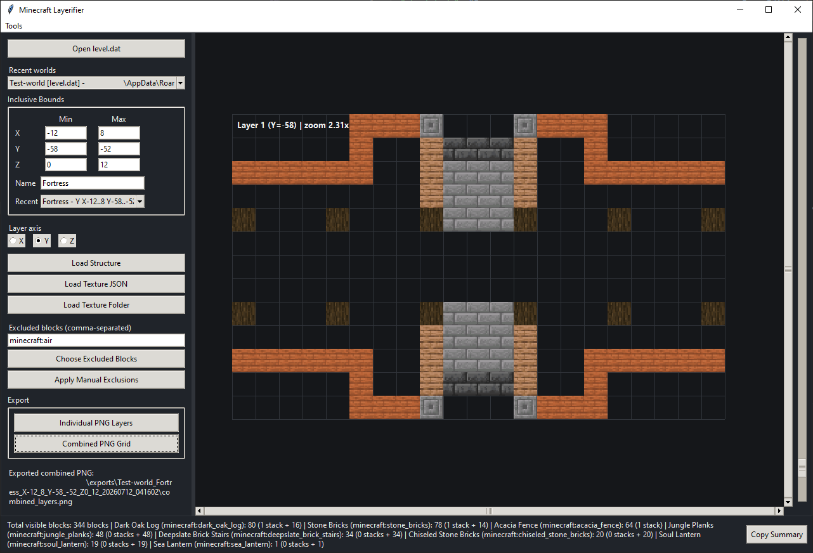

# Minecraft Layerifier

A desktop GUI tool for viewing player-built Minecraft Java Edition structures one layer at a time.



> [!NOTE]  
> I suggest putting the Layerifier executable in a separate folder, as the program will create config files, localizations and PNG exports in its folder.

## Setup

At least Python version 3.10 is recommended.

```
python -m pip install -r requirements.txt
python minecraft_layerifier.py
```

## Features

- Opens a Java Edition `level.dat` file and reads the adjacent `region/*.mca` files.
- Supports modern Anvil chunk palettes used by Minecraft 1.16+ and many older Anvil chunks.
- Displays one layer at a time with a toggleable grid.
- Layer axis can be `Y`, `Z`, or `X`. `Y` is Minecraft's vertical axis.
- Navigate layers with the vertical slider, arrow keys, `PageUp`/`PageDown`, and optionally by clicking the schematic.
- Zoom with the mouse wheel.
- Drag the schematic to pan around large or zoomed views.
- Shows block names and coordinates on hover.
- Excludes selected block IDs from view and exports. A searchable exclusion picker with block previews, IDs, localized names, and highlighted excluded blocks is present.
- Supports texture folders, custom atlas JSON files, and Minecraft's own `assets/minecraft/atlases/blocks.json`.
- Includes built-in generated block tiles, so a texture source is optional but strongly suggested nonetheless.
- Exports individual layer PNGs with layer labels, or one combined PNG arranged in a compact grid.
- Shows a total block summary in the app, including total count, per-block counts, and stack notation.
- Saves recent coordinate regions per `level.dat`; each world can have multiple saved regions.
- Theme, click-to-advance, grid, tooltip, texture path, export path, tile sizes, and zoom settings options.


## GUI Localization

You can choose the app language in `Tools > Options`, and restart the program for changes to apply. Currently, English and Russian languages are supported.

GUI strings are loaded from `localizations/*.json`. If you wish to contribute a new language, make a copy of `localizations/template.json` file, rename to `xx.json`, where `xx` is the two letter locale code, and make a pull request. 


## Basic Usage

1. Click `Open level.dat` and select the `level.dat` file inside a Minecraft Java world folder.
2. Enter the structure bounds as inclusive minimum and maximum `X`, `Y`, and `Z` coordinates. This can take a few tries to get right.
3. Optionally enter a structure name. This is saved with region recents and used in export folder names for ease of use.
4. Choose the layer axis using the `X`, `Y`, or `Z` radio buttons. Use `Y` (default) for vertical layers from bottom to top.
5. Click `Generate schematic` to create a layered view of the structure in set boundaries.
6. Use the layer slider on the right, arrow keys, `PageUp`/`PageDown` to switch layers and mouse wheel to zoom.
7. Open `Tools -> Options` to enable click-to-advance, switch between dark and light mode, or change default texture/export folders.

The summary at the bottom lists the total block count and each block type as `Name (id): amount (stacks + remainder)`. Excluded blocks are omitted from the summary and exports.


## Textures

> [!IMPORTANT]  
> This program is not shipped with Minecraft textures. 

You must select a texture atlas JSON found at `assets/minecraft/atlases/blocks.json` or the texture folder found at `assets/minecraft/textures/block` from an extracted Minecraft .jar file of the desired game version. You can extract this .jar file by making a copy of that file, renaming the extension to .zip, and unzipping it. You may also opt to select your own texture atlas and textures from a custom resource pack using the corresponding buttons.

In general, textures are optional but highly recommended. If no texture source is loaded, the app renders blocks as colored squares.

Supported texture sources:

- A folder containing block PNGs, such as `assets/minecraft/textures/block` from an extracted Minecraft jar. Use `Load Texture Folder`.
- Minecraft's own `assets/minecraft/atlases/blocks.json`; the app resolves it to the adjacent `textures/block` folder. Use `Load Texture JSON`.
- A custom atlas JSON file using the format below. Use `Load Texture JSON`.

The default project-local texture folder is `textures/`. You can put PNG files there or change the path in `Options`.

For best texture matching, select either `assets/minecraft/atlases/blocks.json` or a folder inside an extracted Minecraft jar. If the adjacent `blockstates`, `models/block`, and `lang` folders are present, the program will use them for model texture aliases and localized in-game block names.


## Custom Atlas Format

Click `Load Texture JSON` and choose a JSON file, which should contain something like this:

```json
{
  "image": "atlas.png",
  "tile_size": 16,
  "blocks": {
    "minecraft:stone": [0, 0],
    "minecraft:dirt": [1, 0],
    "minecraft:oak_planks": [2, 0],
    "minecraft:glass": [48, 0, 16, 16]
  }
}
```


## License

This project is licensed under the MIT license. 


## Notes

- This tool targets Java Edition world data. Bedrock worlds use a different storage format and are thus not supported at this time.
- Very large boundary selections can take a while to generate a layer and may use a significant amount of RAM. 

> [!NOTE]  
> As always, when it comes to open-source software, I would like to invite you to check the source code for anything suspicious before you run it.
